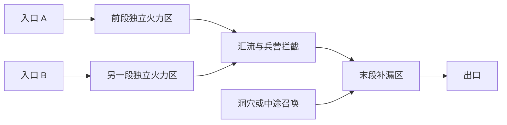
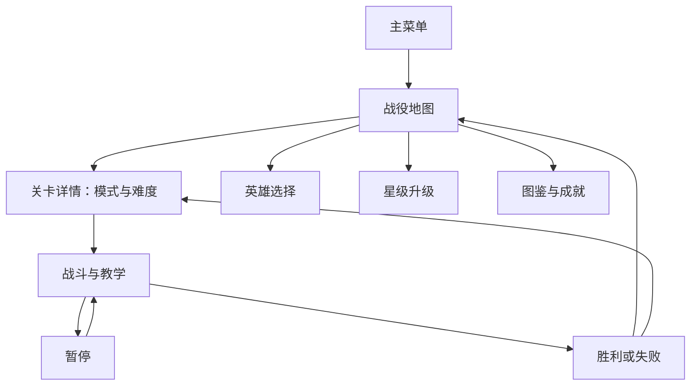
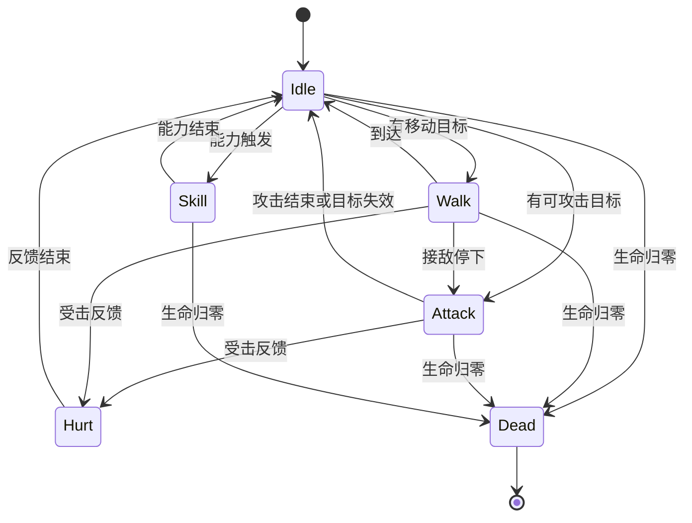

> 2026-10-02 更新：当前实现基准已固定为 Steam Build 24662480，26关配置、13英雄和版本差异见 [reference-v4.md](reference-v4.md)，验收见 [verification-v4.md](verification-v4.md)。下文保留为前期研究资料。

# 《王国保卫战》初代研究：规则、关卡、平衡、UI 与美术动画

研究日期：2026-10-01。用途：作为《奶龙保卫战》后续设计、制作和验收的参考基线。

本次交付是资料研究，不修改现有游戏规则。本文以 **Kingdom Rush 初代的现代电脑版本**为主要参照，同时记录 Flash、移动端与后续更新的差异；不把 Frontiers、Origins、Vengeance、Alliance 或玩家模组当成初代内容。

## 阅读约定与证据边界

- **资料事实**：有公开来源支持的内容。官方页面用于确定产品范围；细节主要来自社区 Wiki，不能等同于开发者正式规格。
- **设计分析**：根据公开规则推导的作用、取舍与制作建议，是本文分析，不是 Ironhide 的设计声明。
- **待核实**：资料冲突、平台差异或缺少可靠证据的内容，不直接写入游戏配置。
- 数值默认按普通难度、无星级升级解释。伤害区间是单次攻击数值；秒数是攻击间隔；金币是该次建造或升级的增量费用。
- 本次没有安装原作逐关实测，也没有提取原作动画帧。道路坐标、完整逐波时间表、UI 像素尺寸、动画帧数与播放速度仍需指定版本的实机采样。

官方确认的核心规模是：十二关主线、八种高级塔、十八项塔能力、十三位英雄，以及超过六十一种敌人。英雄和额外关卡包含后续更新内容，不能理解为 2011 年最初发布时全部存在。[Steam 官方介绍](https://store.steampowered.com/app/246420/Kingdom_Rush___Tower_Defense/)

## 1. 原作最值得对标的部分

**设计分析：**原作的特色，是在有限塔位上用少量塔系解决不断变化的战场问题。兵营改变敌人在火力区停留的时间；英雄和援军修补局部缺口；高级塔提供不同的解决方式；地图和波次决定何时需要这些方式。

可以把一局中的决策分成五层：

| 决策层 | 玩家实际要判断的事 | 对《奶龙保卫战》的意义 |
| --- | --- | --- |
| 空间 | 哪个塔位能覆盖更长道路、多条路线或汇流点 | 地图设计要先于塔的伤害调参 |
| 经济 | 先铺基础塔，还是集中升级一个关键塔 | 金币节奏必须制造机会成本 |
| 克制 | 物抗、魔抗、飞行、恢复、召唤如何处理 | 敌人应改变打法，而不只是增加血量 |
| 时间 | 提前开波、技能冷却、补员和爆发如何衔接 | 必须让操作时机产生实际价值 |
| 注意力 | 英雄走位、集结点、技能落点、Boss 事件谁先处理 | 信息提示要清楚，不能用混乱制造难度 |

原作官方也把指挥士兵、招募精灵、火雨、援军和不同地形列为主要特征。[Ironhide 官方介绍](https://www.ironhidegames.com/Games/kingdom-rush)

## 2. 平台与版本：先确定比较对象

| 项目 | Flash 历史版本 | 现代移动端 | Steam 电脑版 |
| --- | --- | --- | --- |
| 英雄 | 较少；存在高级内容与星星开启机制 | 部分免费，部分内购 | 官方介绍为十三位，无额外购买费用 |
| 第二关名称 | The Farmlands | 常见 Outskirts | 常见 Outskirts |
| 第一波前出售 | 与现代版有差异 | 可全额返还 | 可全额返还 |
| 野蛮人第三能力 | Hunting Nets | Whirlwind Attack | Whirlwind Attack |
| Sasquatch 招募价格 | 500 | 400 | 400 |
| 火雨施放区域 | 历史版可用范围更宽 | 主要道路有效区及特定场景目标 | 同类限制 |
| 宝石道具商店 | 不应套用现代移动端规则 | 有 | 不作为电脑版基准 |
| 无尽关 Rage Valley | 无 | 有 | 不作为电脑版基准 |

此表只概括影响设计的差异，实际行为仍应记录游戏构建版本。[初代版本差异](https://kingdomrushtd.fandom.com/wiki/Kingdom_Rush)、[Steam 官方介绍](https://store.steampowered.com/app/246420/Kingdom_Rush___Tower_Defense/)

社区关卡目录列出十二关主线和十四关额外内容，共二十六个战役关卡。Steam 商店的宣传列表没有逐项列出其中所有章节，不能仅把商店列举项相加就断言某一安装版本只有二十四关。[关卡目录](https://kingdomrushtd.fandom.com/wiki/Category:Levels)、[关卡总览](https://wikily.gg/kingdom-rush/stages)

**本项目的比较口径建议：**以电脑版、不使用移动端消耗道具的正常战斗为基准；保留四位奶龙英雄全部开放的既定设计。这是本项目选择，不是对初代英雄解锁流程的复制。

## 3. 核心规则与战斗闭环

### 3.1 生命、胜负与星级

| 项目 | 初代规则 |
| --- | --- |
| 战役初始生命 | 20 |
| 三星 | 剩余 18–20 生命 |
| 二星 | 剩余 6–17 生命 |
| 一星 | 剩余 1–5 生命 |
| 失败 | 生命耗尽 |
| 敌人漏过 | 按类型扣生命，并非所有敌人都扣 1 |
| Boss 漏过 | 通常扣 20；在标准 20 生命条件下失败 |

移动端增生命道具会改变“Boss 漏过必败”的前提，因此不能把这一结论扩展到所有道具状态。[Campaign](https://kingdomrushtd.fandom.com/wiki/Campaign)、[Lives](https://kingdomrushtd.fandom.com/wiki/Lives)

**实现含义：**胜利要等最终波的存活敌人、召唤敌人和 Boss 阶段处理结束；不要只看波次计数。死亡、金币、漏怪扣血与结算均应只提交一次。

### 3.2 建造、升级与出售

固定塔位限制玩家的空间选择。四类基础塔逐级升级，再选择两种高级分支之一；高级塔的能力另花金币购买。

战斗中常规出售返还累计投入的 **60%**。现代版第一波前可以全额返还；弓箭升级树的 Salvage 将弓箭系战斗中出售返还提高到 **90%**。这不是全塔系统一 90%。[升级树](https://kingdomrushtd.fandom.com/wiki/Upgrades)、[经济与炮塔费用说明](https://wikily.gg/kingdom-rush/towers/dwarven-bombard)

**设计分析：**开波前全额返还允许玩家调整初始布局；开波后损失金币使换塔成为有代价的决策。高级能力的价格需要计入完整方案，不能只比较塔身价格。

### 3.3 波次与提前开波

敌人按预设波次、路线和批次出现。提前开波可以获得额外金币，并缩短主动技能剩余冷却；提前得越多，奖励通常越明显。该机制同时增加同屏压力，形成经济收益与风险的交换。本文不提供未经源码或实测确认的逐秒金币公式。[初代玩家机制说明](https://www.reddit.com/r/kingdomrush/comments/rll70m/kingdom_rush_original_beginners_guide_101/)

**设计分析：**波间时间也是资源。可以补员、恢复英雄、等火雨，或牺牲这些恢复机会换金币。只有“提前开波加金币”会保留经济奖励，却削弱原作的技能节奏联动。

### 3.4 兵营与拦截

基础兵营维持三名士兵，士兵在道路附近的集结点活动，拦截地面敌人。阵亡后重新训练；升级兵营会补回阵亡士兵并恢复受伤士兵。脱战士兵能够恢复生命。[Militia Barracks](https://kingdomrushtd.fandom.com/wiki/Militia_Barracks)、[Knights Barracks](https://kingdomrushtd.fandom.com/wiki/Knights_Barracks)

集结点不是装饰：它决定敌人被停在哪段道路、受到哪些塔的火力，以及兵营能否照顾分路。飞行敌人不受常规地面拦截。

**设计分析：**兵营提供的是停留时间和阵地稳定性。把士兵堆在火力区外，可能只是让他们阵亡；放在群伤覆盖内，才会放大炮塔收益。迁移集结点应存在真实的移动过程。

### 3.5 伤害与克制

| 类型 | 核心规则 | 不能混淆的点 |
| --- | --- | --- |
| 物理 | 受物理护甲减免 | 高血量与高护甲是不同问题 |
| 魔法 | 绕过物理护甲，受魔抗减免 | 魔法不等于无视全部防御 |
| 真实 | 不受常规护甲、魔抗减免 | 不代表免疫标签和 Boss 规则不存在 |
| 爆炸 | 初代炮兵的重要规则：只计入一半物理护甲，忽略魔抗 | 不能简单当成普通物理伤害 |

护甲和魔抗是不同维度，不应由同一个“防御力”字段替代。[护甲与魔抗](https://kingdomrushtd.fandom.com/wiki/Armor_and_Magic_resistance)、[初代炮兵机制](https://wikily.gg/kingdom-rush/towers/dwarven-bombard)

**对空要拆成两个判断：是否能主动选中空中目标、伤害范围是否能波及空中目标。**基础炮塔不能主动攻击飞行敌人，但地面爆炸存在波及附近空中单位的情况；Tesla 本身能对空，Big Bertha 的导弹也能对空。[Musketeer Garrison](https://kingdomrushtd.fandom.com/wiki/Musketeer_Garrison)、[Tesla x104](https://kingdomrushtd.fandom.com/wiki/Tesla_x104)、[500mm Big Bertha](https://kingdomrushtd.fandom.com/wiki/500mm_Big_Bertha)

### 3.6 控制与特殊状态

不能仅实现一套通用“减速、眩晕、毒伤”就认为与原作等价：

- 缠绕、冻结、传送和变羊具有不同效果与目标限制。
- Arcane 的传送排除 Boss／小 Boss，每个敌人最多被传送三次。
- Rangers 的缠绕也有目标限制，不能无限永久定身。
- 变羊会移除敌人能力、防御并降低生命，但羊继续前进，仍可能漏过；玩家可以点击羊处理。
- 毒伤对部分蜘蛛、亡灵等目标无效；不能把所有敌人都设为相同状态接受者。

这些限制来自具体能力，不是“所有 Boss 都在拦截 3.5 秒后穿过”的统一初代规则。[Arcane Wizard](https://kingdomrushtd.fandom.com/wiki/Arcane_Wizard)、[Rangers Hideout](https://kingdomrushtd.fandom.com/wiki/Rangers_Hideout)、[Sorcerer Mage](https://kingdomrushtd.fandom.com/wiki/Sorcerer_Mage)

## 4. 四类基础塔：价格、成长与职责

下表用于量级比较。基础魔法伤害在资料中存在面板下限与实际取整差异，不能把 9 与 10 的差别当成已经解决；后续数据录入应对照选定构建。

| 塔系 | I / II / III 增量金币 | 基础攻击或士兵成长 | 主要职责 |
| --- | --- | --- | --- |
| 弓箭 | 70 / 110 / 160 | 单发约 4–6 / 7–11 / 10–16；间隔 0.8 / 0.6 / 0.5 秒 | 高频物理、清小怪、对空 |
| 兵营 | 70 / 110 / 160 | 普通难度士兵生命 50 / 100 / 150；护甲 0 / 15 / 30% | 三人拦截、建立火力区 |
| 法师 | 100 / 160 / 240 | 面板伤害约 9–17 / 23–43 / 40–74；间隔约 1.5 秒 | 单体魔法、处理物抗 |
| 炮兵 | 125 / 220 / 320 | 爆炸伤害 8–15 / 20–40 / 30–60；间隔约 3 秒 | 聚集地面群体、依赖拦截配合 |

来源：[塔伤害与攻速汇总](https://kingdomrushtd.fandom.com/wiki/Source:Tower_Damage_Per_Second)、[兵营成长](https://wikily.gg/kingdom-rush/towers/militia-barracks)、[炮兵成长](https://wikily.gg/kingdom-rush/towers/dwarven-bombard)。表中不包含星级升级，不套用 Frontiers 的同名塔升级树。

三级基础塔累计投资分别为：弓箭／兵营 340，法师 500，炮兵 665。高级分支费用还要在此基础上追加。这个累计成本是后续平衡比较的必要分母。

**设计分析：**升级同时改变火力、单位强度和造型，让玩家看到投资结果。炮兵前期贵、攻速慢，如果没有聚怪条件，收益有限；仅把炮兵做成更大的单发伤害，会丢掉它的战术前提。

## 5. 八种高级塔与十八项能力

八种高级塔不是统一的“两技能模板”：弓箭、法师、炮兵各分支两项；圣骑士与野蛮人各三项，总计十八项。以下中文为便于理解的译名，英文保留为检索标识。

### 5.1 弓箭分支

| 分支 | 追加费用与普攻 | 购买能力 | 职责 |
| --- | --- | --- | --- |
| Rangers Hideout 游侠 | 230；13–19，0.4 秒 | Poison Arrows：三秒毒伤，5/10/15 每秒；每级 250。Wrath of the Forest：群体缠绕，1/2/3 秒，最多 4/6/8 目标；300/150/150 | 高频输出、持续伤害、留住敌群 |
| Musketeer Garrison 火枪手 | 230；35–65，1.5 秒 | Sniper Shot：20/40/60% 秒杀概率，Boss 排除；每级 250。Shrapnel Shot：近距离霰弹范围攻击；每级 300 | 远距离单体、精英处理、局部爆发 |

资料：[Rangers](https://kingdomrushtd.fandom.com/wiki/Rangers_Hideout)、[Musketeer](https://kingdomrushtd.fandom.com/wiki/Musketeer_Garrison)。狙击未秒杀时的伤害公式存在资料表述差异，本文不把其作为确定配置。

**设计分析：**游侠的价值是持续覆盖和控制，火枪手的价值是距离和高价值目标。两塔不能只做成“快低伤”与“慢高伤”；毒伤、缠绕、秒杀和霰弹改变了适用场景。

### 5.2 兵营分支

| 分支 | 追加费用与单位 | 三项能力 | 职责 |
| --- | --- | --- | --- |
| Holy Order 圣骑士 | 230；生命 200，基础护甲 50% | Healing Light：自身治疗，150/150/150。Shield of Valor：额外 15 个百分点护甲，250。Holy Strike：概率范围打击，220/150/150 | 持续承受物理攻击、稳定拦截 |
| Barbarian Mead Hall 野蛮人 | 230；生命 250，无基础护甲，较高近战伤害 | Throwing Axes：投斧，可对空，200/100/100。More Axes：提高近战伤害，300/100/100。Whirlwind Attack：概率范围旋风，150/100/100 | 用近战输出与群伤换取防线收益 |

资料：[Holy Order](https://kingdomrushtd.fandom.com/wiki/Holy_Order)、[Barbarian Mead Hall](https://kingdomrushtd.fandom.com/wiki/Barbarian_Mead_Hall)。Holy Strike 的伤害类型、野蛮人的第三能力及攻击间隔有平台差异；上表以现代版能力结构为参照。

**设计分析：**圣骑士与野蛮人必须具有不同的战场风险。前者适合持续拦截，后者需要保护和正确集结。野蛮人的对空能力还允许玩家用金币修补阵容短板。

### 5.3 法师分支

| 分支 | 追加费用与普攻 | 购买能力 | 职责 |
| --- | --- | --- | --- |
| Arcane Wizard 奥术法师 | 300；76–140，2 秒 | Death Ray：非 Boss 秒杀，350/200/200，冷却 20/18/16 秒。Teleport：群体后移，300/100/100，10 秒冷却，最多 4/5/6 目标 | 重甲大怪、精英、单体爆发与延长道路 |
| Sorcerer Mage 巫术师 | 300；42–78，1.5 秒；有诅咒削甲机制 | Polymorph：变羊，300/150/150。Summon Elemental：350/150/150，元素生命 600/700/800、护甲 40/50/60% | 为物理输出削甲，以召唤单位补拦截 |

资料：[Arcane Wizard](https://kingdomrushtd.fandom.com/wiki/Arcane_Wizard)、[Sorcerer Mage](https://kingdomrushtd.fandom.com/wiki/Sorcerer_Mage)。元素伤害与攻速有平台差异。羊不再参与正常近战，但仍有前进和漏怪风险。

**设计分析：**奥术解决高价值单体；巫术把魔法塔变成物理协同和地面支援设施。若奶龙星辉和冰霜分支都只有范围伤害与控制，会与原作这组差异明显不同，但可以作为原创方向保留。

### 5.4 炮兵分支

| 分支 | 追加费用与普攻 | 购买能力 | 职责 |
| --- | --- | --- | --- |
| 500mm Big Bertha 大炮 | 400；50–100，3.5 秒 | Dragonbreath Launcher：追踪导弹，250/100/100。Cluster Launcher：3/5/7 枚子炸弹，250/150/150 | 远处补火力、爆发清群、导弹补对空 |
| Tesla x104 特斯拉 | 375；面板 30–55，约 2.25 秒 | Supercharged Bolt：增加连锁目标，250/250。Overcharge：攻击时周边范围伤害，250/125/125 | 密集敌群、持续连锁、对空与地面协同 |

资料：[Big Bertha](https://kingdomrushtd.fandom.com/wiki/500mm_Big_Bertha)、[Tesla](https://kingdomrushtd.fandom.com/wiki/Tesla_x104)。Tesla 电弧有伤害分段和星级升级联动，面板不能直接当成所有目标每次实际受到的伤害；过载伤害类型的资料表述也有冲突，需实机核对。

**设计分析：**Tesla 的高覆盖收益依赖聚怪和升级协同，不宜只复制一个很高的伤害数字。大炮和电塔还应在弹道、声音、攻击节奏和轮廓上明显不同。

## 6. 英雄：操作、成长与名单

### 6.1 初代英雄模型

一局选择一位英雄；玩家控制移动，技能自动使用。英雄每局从一级成长，最高十级，下一局重置，不是 Frontiers 式跨关保留等级。英雄阵亡后复活，不同英雄的属性与复活时间有区别。[初代英雄规则](https://kingdomrushtd.fandom.com/wiki/Heroes/Kingdom_Rush)

常见能力成长节点为：第一项技能在英雄等级 2/5/8 获得三档；第二项在 4/7/10。公开资料列出的累计经验节点为 0、300、900、2000、4000、8000、12000、16000、20000、26000；这些数值用于初代成长模型参考，不表示奶龙必须照搬。[英雄等级与经验](https://wikily.gg/kingdom-rush/hero-levels)

英雄经验与实际攻击、能力使用有关，不能简单等同于“击杀拿固定经验”。操作英雄参与合适的战斗，也是成长决策。

### 6.2 十三位英雄及能力结构

| 英雄 | 能力一 | 能力二 | 可提炼的玩法方向 |
| --- | --- | --- | --- |
| Gerald Lightseeker | Courage | Shield of Retribution | 防线支援、盾牌反击 |
| Alleria Swiftwind | Multishot | Call of the Wild | 远程箭雨、召唤伙伴 |
| Malik Hammerfury | Hammer Smash | Earthquake | 地面近战、范围控制 |
| Bolin Farslayer | Mine Layer | Tar Bomb | 地雷、减速区域 |
| Magnus Spellbane | Mirage | Arcane Storm | 魔法输出、分身 |
| Ignus | Surge of Flame | Flaming Frenzy | 火焰冲击、近战爆发 |
| King Denas | Royal Edict | Catapult Barrage | 塔支援、区域轰击 |
| Elora Wintersong | Permafrost | Ice Storm | 冰冻与道路控制 |
| Ingvar Bearclaw | Ancestor Call | Bear Form | 召唤、变身前排 |
| Hacksaw | Flying Sawblade | Tiiiimber! | 弹跳锯片、精英处理 |
| Oni | Sword Torment | Death Strike | 近战爆发与处决 |
| Thor | Mjolnir | Thunderclap | 雷锤、范围打击 |
| Ten'Shí | Fireball Rain | Transformation | 流星、强力变身 |

能力名称来源：[英雄能力与经验表](https://wikily.gg/kingdom-rush/hero-levels)。最后一列为本文的设计归纳，不是官方角色强度评级。

现代英雄列表不等于首发阵容。Ten'Shí 为后续周年更新加入；免费获取与开放关卡按平台存在差别。[Ten'Shí](https://kingdomrushtd.fandom.com/wiki/Ten%27Sh%C3%AD)

### 6.3 对四位奶龙英雄的启发

**设计分析：**四位英雄已经能覆盖前排、远程、法师、治疗，但要避免“所有英雄只是相同的两次范围技能”。应分别验证：

- 团团是否能稳定建立关键拦截点，撤退是否明显影响防线。
- 闪闪是否能及时处理空中、远程或落单目标，走位是否比站桩有意义。
- 星宝是否依赖范围选点与控制时机，对魔抗目标是否有明确短板。
- 暖暖是否能支撑兵营打法，同时避免与高护甲形成无成本永久封路。

英雄死亡应有代价，死亡／复活动作、肖像状态与剩余时间必须对应。统一十八秒复活是当前项目选择，不能描述为初代统一规则。

## 7. 两种全局主动技能

| 项目 | Call Reinforcements 援军 | Rain of Fire 火雨 |
| --- | --- | --- |
| 基础行为 | 召唤两名临时单位 | 多颗陨石在指定区域连续落下 |
| 基础冷却 | 10 秒 | 80 秒 |
| 持续 | 单位约 20 秒 | 落点序列；升级可留下燃烧地面 |
| 基础强度 | 普通难度初始单位生命约 30 | 初始三颗，每颗 30–60 真实伤害 |
| 升级方向 | 更强士兵、护甲、投矛对空 | 更多陨石、增伤、范围、燃烧地面、冷却缩短 |
| 战术定位 | 高频微操、临时拦截、诱导敌人 | 低频危机处理与关键波爆发 |

来源：[援军](https://kingdomrushtd.fandom.com/wiki/Call_Reinforcements)、[主动技能](https://wikily.gg/kingdom-rush/spells)。火雨后期冷却可降到六十秒；燃烧地面与给敌人附着持续燃烧状态不是同一种规则。

**设计分析：**援军弱但频繁，使它成为贯穿全局的操作；火雨强但冷却长，迫使玩家做取舍。当前奶龙版援军生命高、冷却长，流星冷却短、单次爆炸，实际节奏会偏向两种中频技能。

建议单独记录：施放准备、有效落点、消耗／冷却提交时点、伤害落地时点、取消行为。不要让视觉延迟偷偷改变规则，也不要让技能在错误落点白白进入冷却。

## 8. 星级升级、难度与挑战模式

### 8.1 六条升级树

初代是六条各五级的线性升级树，依序购买，可以重置。四条对应塔系，两条对应主动技能。弓箭、兵营、法师各需九星；炮兵十星；火雨十三星；援军十五星，全部合计六十五星。[升级树总览](https://wikily.gg/kingdom-rush/upgrades)

| 树 | 五级费用 | 代表性的规则变化 |
| --- | --- | --- |
| 弓箭 | 1/1/2/2/3 | 弓箭系出售 90%、射程、穿甲、概率双倍伤害 |
| 兵营 | 1/1/2/2/3 | 生命、护甲、集结范围与补员、反伤 |
| 法师 | 1/1/2/2/3 | 射程、命中削甲、塔费用、增伤、减速 |
| 炮兵 | 1/1/2/3/3 | 增伤、射程、塔费用、能力费用、爆炸边缘伤害 |
| 火雨 | 2/2/3/3/3 | 陨石数量、燃烧地面、范围、冷却、额外陨石 |
| 援军 | 2/3/3/3/4 | 逐级更换兵种，最终加入投矛 |

代表效果据[初代升级条目](https://kingdomrushtd.fandom.com/wiki/Upgrades)。**设计分析：**升级不仅是每级加 8% 伤害；它改变某类打法的经济、操作和敌人适应能力。首期可以缩短树，但应该保留质变节点。

### 8.2 三种关卡模式

| 模式 | 生命与波次 | 主要约束 | 成绩 |
| --- | --- | --- | --- |
| Campaign 战役 | 20 生命，关卡自己的波数 | 逐步开放塔和内容 | 1–3 星 |
| Heroic 英雄挑战 | 1 生命，6 个强化波 | 关卡规定升级上限、英雄限制 | 额外一星 |
| Iron 钢铁挑战 | 1 生命，1 个连续大波 | 限定可建塔系，另有升级／英雄限制 | 额外一星 |

战役三星后开放对应挑战。初代前九关的英雄挑战不允许英雄，不能因为叫“英雄挑战”就默认一定有英雄。[Heroic Challenge](https://kingdomrushtd.fandom.com/wiki/Heroic_Challenge)、[模式汇总](https://wikily.gg/kingdom-rush/game-modes)

**设计分析：**钢铁挑战是限制条件下重解地图；英雄挑战是更苛刻的波次与容错。它们不是简单把敌人血量乘 1.25。每张地图最多三颗战役星加两颗挑战星，让重复挑战与升级有明确联系。

### 8.3 难度

公开资料的基本血量倍率为 Casual 0.8、Normal 1.0、Veteran 1.2；简单难度还可能改变部分友军生命。不要据此推断全部平台所有敌人的攻速、伤害与特殊能力也采用同一倍率。[Difficulty](https://kingdomrushtd.fandom.com/wiki/Difficulty)

**设计分析：**模式决定解题条件，难度决定压力程度。奶龙首期的“挑战难度”是一个难度档，并不等同于原作 Heroic 或 Iron 模式，命名和介绍应区分。

## 9. 十二关主线：地图、解锁与教学顺序

表中数值为战役模式。主线名称保留英文，中文仅作说明。塔位数不含另列的预设设施或特殊单位；末两关没有取得足够可靠的塔位核对，留空。

| 顺序 | 地图 | 波数 | 初始金币 | 塔位 | 地图机制与内容开放 | 来源 |
| --- | --- | --- | --- | --- | --- | --- |
| 1 | Southport 南港 | 7 | 265 | 8 | 单路、一级塔；哥布林与兽人，教学起点 | [Southport](https://kingdomrushtd.fandom.com/wiki/Southport) |
| 2 | The Farmlands / Outskirts 农地 | 7 | 220 | 7 | 二级塔；快速狼类开始要求拦截 | [Farmlands](https://kingdomrushtd.fandom.com/wiki/The_Farmlands) |
| 3 | Pagras 帕格拉斯 | 11 | 300 | 12 | 两个入口；萨满治疗、食人魔高血量 | [Pagras](https://kingdomrushtd.fandom.com/wiki/Pagras) |
| 4 | Twin Rivers 双河 | 13 | 520 | 15 | 分开的两路压力；三级基础塔开放 | [Twin Rivers](https://kingdomrushtd.fandom.com/wiki/Twin_Rivers) |
| 5 | Silveroak Forest 银橡森林 | 15 | 700 | 12 | 三个入口、精灵设施与预设塔；游侠在第五波开放；蜘蛛与召唤 | [Silveroak](https://kingdomrushtd.fandom.com/wiki/Silveroak_Forest) |
| 6 | The Citadel 城堡 | 17 | 700 | 15 | 多入口、预设守卫；奥术与圣骑士开放；飞行与重甲；Juggernaut | [Citadel](https://kingdomrushtd.fandom.com/wiki/The_Citadel) |
| 7 | Coldstep Mines 冰阶矿区 | 16 | 700 | 11 | 三入口、洞穴捷径；火枪手；巨魔恢复与冬狼 | [Coldstep](https://kingdomrushtd.fandom.com/wiki/Coldstep_Mines) |
| 8 | Icewind Pass 冰风隘口 | 18 | 800 | 12 | 洞穴、Sasquatch；野蛮人与 Big Bertha | [Icewind](https://kingdomrushtd.fandom.com/wiki/Icewind_Pass) |
| 9 | Stormcloud Temple 风暴神殿 | 19 | 800 | 15 | 多入口与洞穴；巫术师、Sunray 设施；J.T. | [Stormcloud](https://kingdomrushtd.fandom.com/wiki/Stormcloud_Temple) |
| 10 | The Wastes 荒原 | 19 | 800 | 待核实 | Tesla 开放；向后期敌群与恶魔主题过渡 | [关卡索引](https://wikily.gg/kingdom-rush/stages)、[Tesla 解锁](https://kingdomrushtd.fandom.com/wiki/Tesla_x104) |
| 11 | Forsaken Valley 遗弃山谷 | 19 | 1300 | 待核实 | 恶魔与亡灵压力；死灵法师的召唤出现 | [关卡索引](https://wikily.gg/kingdom-rush/stages)、[Necromancer 出场](https://kingdomrushtd.fandom.com/wiki/Necromancer) |
| 12 | The Dark Tower 黑暗之塔 | 15 + Boss 战 | 1300 | 13 | 双北侧入口、墓地、召唤圈；封塔；Vez'nan 双阶段 | [Dark Tower](https://kingdomrushtd.fandom.com/wiki/The_Dark_Tower) |

### 9.1 关卡设计分析

**第一段，1–3 关：**逐步加入建造、二级升级、快怪、分路、治疗和大体型。不是第一关就开放全部高级塔和十种敌人。让玩家先理解“为什么这个位置好”“为什么需要兵营”。

**第二段，4–6 关：**扩大空间决策、开放三级与高级塔，再加入蜘蛛、重甲和飞行，最后以 Boss 检查防线。新塔紧邻新问题开放，玩家有使用理由。

**第三段，7–9 关：**洞穴让敌人跳过一部分表面道路；巨魔恢复改变伤害需求；地图特殊设施增加操作选项。地图从背景变成参与规则的对象。

**第四段，10–12 关：**完整塔系面对恶魔、召唤、复合敌群和 Boss 干扰。后段地图不能只有“前面地图加更多怪”，需要局部威胁与注意力分配。

这些分段是本文归纳。它们适合缩编成奶龙的三关结构：第一关教会组合，第二关检验克制与分路，第三关检验系统协同和场景事件。

### 9.2 地图拓扑为什么影响平衡

下图是概念示意，不是原作逐像素道路复刻。



**设计分析：**同一座塔覆盖两段相邻道路，收益可能超过单段塔位；汇流处适合范围伤害，但入口上的支援怪可能需要提前处理；中途召唤绕过前半段投资，要求玩家保留末段防线。

绘制地图前应先做灰盒并记录：入口到出口的实际行进时间、每个塔位覆盖道路长度、对各路线的覆盖比例、集结点有效区域、洞穴和生成点的跳过距离。不能只靠一张漂亮背景确定这些值。

### 9.3 第一关的可核对波次例子

Southport 战役公开波表如下，展示原作如何用少量敌人完成教学：[Southport 波次](https://kingdomrushtd.fandom.com/wiki/Southport)

| 波 | 敌人 |
| --- | --- |
| 1 | 哥布林 3 |
| 2 | 哥布林 6 |
| 3 | 哥布林 9 |
| 4 | 哥布林 4、兽人 1 |
| 5 | 兽人 3 |
| 6 | 哥布林 10、兽人 4 |
| 7 | 哥布林 16 |

这是数量表，不包含每批延迟、出怪间隔和道路节点，因此还不能直接作为精确复刻数据。后续十二关的完整波表应独立保存为结构化配置，并记录采样版本，避免把百科文本当成可运行关卡。

## 10. 额外章节与地图设施

### 10.1 额外关卡目录

| 主题 | 关卡 | 可关注的研究方向 |
| --- | --- | --- |
| 蜘蛛 | Sarelgaz's Lair | 高魔抗、密集小怪与大体型压力 |
| 兽人 | Ruins of Acaroth | 兽人体系的后期强化 |
| 腐化森林 | Rotten Forest → Fungal Forest | 场景生成、腐化生态、密度压力 |
| 匪徒章节 | Hushwood → Bandit's Lair | 速度、精英与分路调度 |
| 冬季章节 | Glacial Heights → Ha'Kraj Plateau | 恢复、巨魔体系与后期爆发需求 |
| 地狱章节 | Pit of Fire → Pandaemonium | 魔抗、死亡爆炸与精英恶魔 |
| Blackburn 章节 | Rotwick → Ancient Necropolis → Nightfang Swale → Castle Blackburn | 亡灵、特殊防御与召唤体系 |

关卡名单据[初代关卡目录](https://kingdomrushtd.fandom.com/wiki/Category:Levels)。第三列是研究方向，不是完整敌人出场表；这些关卡不能简单沿用主线波数或塔位配置。

Rage Valley 是移动端无尽内容：动态波次和图腾事件的目标与固定战役不同，不属于本项目首期必须实现的范围。[Rage Valley](https://kingdomrushtd.fandom.com/wiki/Rage_Valley)

### 10.2 地图设施

| 设施 | 已取得的规则 | 制作启发 |
| --- | --- | --- |
| 精灵设施 | Silveroak 有特殊招募设施，可提供额外友军 | 同一地图允许有非标准塔系的支援资源 |
| Sasquatch | Icewind 的冰封单位可用火雨解冻，再花金币招募；现代版 400 | 技能也可以与地图物件互动 |
| Sunray Tower | Stormcloud 的手动射线设施；可招募最多四名施法者，每名 100，人数改变射线强度与冷却 | 地图专属主动设施增加调度，但须清楚提示 |
| 洞穴 | 敌人进入后从另一处出现，缩短可攻击区间 | 可见道路长度不等于有效受击时间 |
| 墓地与召唤圈 | 后段关卡存在额外生成点 | 入口波次表必须与场景生成事件分别记录 |

来源：[Silveroak](https://kingdomrushtd.fandom.com/wiki/Silveroak_Forest)、[Icewind](https://kingdomrushtd.fandom.com/wiki/Icewind_Pass)、[Sunray Tower](https://kingdomrushtd.fandom.com/wiki/Sunray_Tower)、[Coldstep](https://kingdomrushtd.fandom.com/wiki/Coldstep_Mines)、[Dark Tower](https://kingdomrushtd.fandom.com/wiki/The_Dark_Tower)。Sunray 在历史平台间有移除／恢复差异，不应把“Flash 独有”当作所有现代版的现状。

## 11. 敌人与 Boss：研究行为而不是只抄属性

### 11.1 基础敌人的功能分类

下表是机制样例，不冒称完整六十余种敌人的数值数据库。每类应继续记录生命、速度、防御、金币、漏怪生命、攻击对象、技能触发、免疫和出场波次。

| 类别 | 原作样例 | 行为／压力 | 对应奶龙设计 |
| --- | --- | --- | --- |
| 基础地面 | Goblin、Orc | 用数量与基础血量建立火力需求 | 蘑菇步兵 |
| 快速 | Wulf、Worg | 减少塔的攻击窗口，要求拦截或控制 | 疾跑虫 |
| 治疗支援 | Shaman | 治疗提升群体续航，改变优先处理目标 | 治疗巫医 |
| 重甲 | Dark Knight、Dark Slayer | 物理塔效率显著下降 | 铁甲野猪 |
| 魔抗 | 蜘蛛、冬狼、恶魔中的相应种类 | 避免法师解决所有问题 | 晶壳甲虫 |
| 飞行 | Gargoyle、Rocket Rider | 绕过士兵，强迫保留对空火力 | 飞行蝙蝠 |
| 高血量 | Ogre、Yeti、Magma Elemental | 占用火力与拦截时间 | 重型食人魔 |
| 恢复 | Troll、Forest Troll | 分散伤害可能被恢复抵消 | 再生树怪 |
| 远程 | Shadow Archer、Necromancer | 提前消耗或压制友军 | 远程投矛怪 |
| 召唤 | Spider Matriarch、Necromancer | 延长战斗、遮挡高价值本体、增加密度 | 分裂史莱姆可承担类似数量压力，但死亡分裂不是等价行为 |
| 死亡威胁 | Demon Spawn | 消灭敌人也会伤害附近友军 | 可作为后续敌人方向 |

前期敌人与解锁据各关资料：[Pagras](https://kingdomrushtd.fandom.com/wiki/Pagras)、[Silveroak](https://kingdomrushtd.fandom.com/wiki/Silveroak_Forest)、[Citadel](https://kingdomrushtd.fandom.com/wiki/The_Citadel)、[Coldstep](https://kingdomrushtd.fandom.com/wiki/Coldstep_Mines)、[Stormcloud](https://kingdomrushtd.fandom.com/wiki/Stormcloud_Temple)。特殊能力据[Dark Knight](https://kingdomrushtd.fandom.com/wiki/Dark_Knight)、[Troll](https://kingdomrushtd.fandom.com/wiki/Troll)、[Necromancer](https://kingdomrushtd.fandom.com/wiki/Necromancer)、[Demon Spawn](https://kingdomrushtd.fandom.com/wiki/Demon_Spawn)。

### 11.2 三个值得作为基准的例子

**Dark Knight：**普通难度生命 300、护甲 80%。在没有穿甲或削甲时，需要 1500 点原始物理伤害才能清掉这 300 生命，而魔法不计这项护甲。这是有效生命的差异，不是把敌人生命直接设成 1500。[Dark Knight 数据](https://kingdomrushtd.fandom.com/wiki/Dark_Knight)

**Necromancer：**普通难度生命 700，可召唤骷髅并远程攻击；它召出的骷髅不给金币。近战接敌可以阻止召唤。这让“把英雄或援军放到本体旁边”成为规则上的应对，而不只是增加一点伤害。[Necromancer 规则](https://kingdomrushtd.fandom.com/wiki/Necromancer)

**Demon Spawn：**死亡时对附近士兵产生爆炸伤害。杀得越快不一定越安全，兵营集结、分散与治疗也参与解题。[Demon Spawn](https://kingdomrushtd.fandom.com/wiki/Demon_Spawn)

**设计分析：**金币应由生成来源决定，而不只由敌人类型决定。正常波次骷髅、墓地生成骷髅、死灵召唤骷髅不能先假定完全相同；否则会出现无限召唤刷钱的意外经济。

### 11.3 三个主线 Boss 与事件层

| Boss | 关卡 | 已确认的关卡位置／事件 | 分析重点 |
| --- | --- | --- | --- |
| Juggernaut | The Citadel | 第十七波的首个主线 Boss | 第一次检验完整防线的持续火力和调度 |
| J.T. | Stormcloud Temple | 第十九波；Boss 战期间有持续小怪压力 | Boss 与小怪必须同时管理，不能只围攻一个大血条 |
| Vez'nan | The Dark Tower | 第十五波处理完后进入 Boss 战；有法师与恶魔形态；此前干扰塔 | 关卡脚本、点塔解封、阶段转换与战斗结束条件 |

资料：[Citadel](https://kingdomrushtd.fandom.com/wiki/The_Citadel)、[Stormcloud](https://kingdomrushtd.fandom.com/wiki/Stormcloud_Temple)、[Dark Tower](https://kingdomrushtd.fandom.com/wiki/The_Dark_Tower)、[Vez'nan 初代形态](https://kingdomrushtd.fandom.com/wiki/Vez%27nan/Kingdom_Rush)。Vez'nan 两形态生命在普通难度通常记作各 6666，但部分历史版本恶魔形态不随难度改变，不能只用统一血量倍率生成全部平台行为。

Dark Tower 的封塔具有玩家干预：出现封印时可点击塔阻止失效。资料中的封塔周期存在分歧；这里只确定“有预警、有干预、会迫使玩家分配注意力”，不指定未核实的秒数。

**对荆棘巨兽的启发：**半血狂暴、召唤、封塔、地面冲击可以保留，但每项要有可读的前兆和实际对策。封塔若只随机让建筑停止，缺乏玩家干预，就更像惩罚；冲击如果有清楚危险区、撤离时间和攻击锁定，才能形成操作挑战。

## 12. 平衡研究：建立可解释的数据模型

本节为**设计分析与计算方法**，不是原作官方的平衡公式。它用于把原作规则转成奶龙项目可验证的调参流程。

### 12.1 不只比较面板 DPS

```text
平均单体 DPS = (伤害下限 + 伤害上限) / 2 / 攻击间隔
物理有效生命 = 生命 / (1 - 物理护甲)
魔法有效生命 = 生命 / (1 - 魔法抗性)
无拦截受击时间 ≈ 火力覆盖的实际道路长度 / 移动速度
```

这只是第一层估计。还要加入：过量击杀浪费、弹道时间、目标转移、攻击前后摇、群伤命中数量、单位恢复、控制时间、召唤物、技能冷却和免疫。

例如 Rangers 基础平均单体 DPS 约 40，Musketeer 约 33.3；不能据此断言游侠在所有地图更好。后者更长的覆盖距离、狙击和霰弹可能改变收益；前者的毒伤和缠绕也需要合适目标。

### 12.2 兵营的价值不是士兵 DPS

```text
兵营带来的额外伤害 ≈ 协同塔在有效拦截期间的总 DPS × 有效延长时间
```

有效延长时间受士兵生命、护甲、敌人攻击、补员、范围攻击、远程压制和集结位置影响。必须分别测量三名士兵持续站住、逐个阵亡、刚升级满血和迁移集结点的情况。

若高护甲、治疗与补员形成稳定闭环，敌人可能长期被挡住。应靠真实的敌人克制、位移或明确 Boss 能力解决，而不是对所有 Boss 隐藏加一个通用穿人计时器。

### 12.3 群伤为何容易失控

```text
一次范围攻击收益 = 对实际命中的每个目标分别结算后求和
```

必须记录中心与边缘伤害、最大目标数、距离衰减、空中波及、重复命中，以及单位被控制后增加的聚集程度。工程塔只要让每次攻击稳定打中五六个目标，即使单体面板不高，也可能压过其他塔。

Tesla、集束炸弹和冻住敌群的协同必须联合测试。不能先分别把每项能力都做得很强，再只用一个默认阵容证明通关。

### 12.4 恢复敌人和治疗敌人

恢复会形成最低持续输出门槛：如果有效 DPS 小于恢复速度，敌人会长期消耗资源。治疗敌人则要求考察治疗覆盖、技能间隔、受治疗目标数量和本体处理难度。

测试时需区分：单目标持续输出、多人集火、低伤高频、慢速高伤、持续毒伤、冻结期间是否恢复、治疗是否受打断。不要把“治疗优先”写在图鉴里，却没有给玩家任何能影响索敌或走位的手段。

### 12.5 波次与经济一起设计

建议每波同时记录以下数据，而不只列怪物数量：

| 维度 | 要记录的值 | 诊断用途 |
| --- | --- | --- |
| 到达时间 | 各入口、各批开始与结束时间 | 是否形成预期重叠压力 |
| 路线压力 | 快怪到出口时间、精英进入关键区时间 | 留给玩家多少反应时间 |
| 可获得金币 | 正常击杀、召唤奖励、提前开波 | 能否在目标波前买到克制方案 |
| 必要投资 | 一套最低可行解的塔身与技能总价 | 是否存在经济死局 |
| 冷却窗口 | 援军、流星、英雄技能、补员 | 危机能否通过操作化解 |
| 失败原因 | 对空不足、支援怪未处理、兵营站错、火力不足 | 难度是否来自可解释的决策 |

不要只让敌人血量按波次线性增加。用小怪掩护支援、快怪穿插慢精英、左右路错峰，以及在玩家关键技能未恢复时到达的新压力，才能检验不同能力。

### 12.6 三关奶龙版的平衡验收矩阵

| 验证项 | 建议方法 | 成功标准 |
| --- | --- | --- |
| 四位英雄 | 每位完成三关，并记录操作路线 | 能通关且策略有差别 |
| 八种分支 | 每种至少一套有效搭配 | 有值得购买的场景和能力 |
| 多种组合 | 后两关至少三类不同塔组合 | 不被一个万能分支统治 |
| 容错 | 故意错位兵营、漏掉对空、乱放技能 | 能观察到明确且合理的后果 |
| 经济 | 记录各波金币与购买时点 | 无重复奖励、无无限召唤刷钱 |
| 快进 | 相同命令与种子比较 1 倍／2 倍 | 结果一致，反馈时序正确 |
| 满星与通关 | 分开测量 | 满星比普通通关要求更高 |

自动模拟适合查规则和数值异常；实际手动试玩才能验证操作负担、提示和策略体验。十二组脚本都满血，并不证明已经达到原作难度或策略深度。

## 13. UI：信息结构、操作流程与反馈

本节把初代常见交互归纳为设计参照；具体按钮位置、快捷键、文字、布局尺寸需要指定电脑构建实机核对，不能把移动端截图直接当桌面 UI 规格。官方确认游戏具有塔／敌人百科与额外挑战模式。[官方功能介绍](https://store.steampowered.com/app/246420/Kingdom_Rush___Tower_Defense/)

### 13.1 页面流程



**设计分析：**战役地图负责探索与进度；详情负责开战决策；战斗只保留当下需要的操作。不要让工坊、存档调试、资产加载信息挤进正常战斗流程。

### 13.2 战斗 HUD 的信息优先级

| 优先级 | 信息 | 表现建议 |
| --- | --- | --- |
| 常驻且立即可读 | 生命、金币、当前波／总波、暂停状态 | 固定区域，数字变化清楚 |
| 常驻操作 | 英雄肖像、援军、流星、暂停 | 图标统一，冷却有进度与可用状态 |
| 按需显示 | 选中塔、射程、费用、升级能力、集结范围 | 就近出现，避免遮挡整个战场 |
| 波前提示 | 入口、下一波构成、提前开波收益 | 和入口关联，让玩家知道压力来源 |
| 紧急信息 | 漏怪、Boss 预警、封塔、英雄阵亡 | 形状与动画提示，不能只靠红色 |

原作常见塔操作使用围绕选中塔的菜单，升级、出售、集结点等与塔的位置相关。奶龙不必照抄像素位置，但需要减少从战场来回找大面板的操作距离。

### 13.3 每种交互要有完整状态

**建造与升级：**未选、悬停、选中、可以买、金币不足、未开放、点击成功、升级完成。展示价格与变化，不能只显示等级数字。高级分支预览应让玩家看见造型、定位与能力。

**集结点：**显示合法范围和道路落点；确认后士兵走过去；非法点保持选择状态并说明原因。集结旗、选中范围与攻击范围应有不同图形。

**英雄移动：**肖像和单位均可选择，目标落点短暂标记；无法到达的区域不要默默失败。死亡时禁用移动、显示复活状态。选择框与脚底锚点一致。

**技能：**待选择时显示鼠标落点、范围和有效性；取消恢复正常输入；释放出现预告；冷却进度始终能读。技能状态不能只靠按钮透明度区分。

**开波：**入口预告与开波按钮区分，悬停看构成，点击才提交。存在多个入口时，让玩家知道这一波影响哪几路。

这些是对奶龙界面的实施建议，不是已实测得到的原作逐项 UI 状态机。

### 13.4 图鉴、教学和结算

图鉴至少说明敌人的防御、移动类型、特殊能力和应对方向；不要把未知数字包装成精确属性。新敌人提示应短、可关闭、可再次查看，避免高压波次中遮挡操作。

教学按需触发：首次建塔、首次升级、首次设置集结、英雄走位、技能、首次飞行／高物抗敌人。每次只教一个操作，然后让玩家在低风险情境中使用。

结算清楚区分通关、剩余生命、星级、最佳成绩和新开放内容；提供重试与回地图。失败原因可以从漏怪记录推导，但不要未经证据声称“建议全建某塔”。

## 14. 美术：原作视觉语言与奶龙转译

官方明确采用插画式卡通画面和士兵近身战斗。[官方美术与战斗描述](https://store.steampowered.com/app/246420/Kingdom_Rush___Tower_Defense/)

以下是**视觉设计分析与本项目制作要求**，不是对原作内部美术规范的声称。本次未测量原作资产比例、线宽、光源角度或色值；官方商店媒体可作为下一步逐帧、逐截图采样入口。

### 14.1 画面层级

| 层 | 目标 | 奶龙版制作要求 |
| --- | --- | --- |
| 背景地形 | 表达森林、河谷、遗迹主题 | 降低局部对比，不能与角色争夺轮廓 |
| 道路 | 一眼识别走向、入口、出口 | 地面纹理有变化，边界连续清楚 |
| 塔位与建筑 | 明确可建与已建；等级可辨 | 基座、设施、操作者共同构成职业轮廓 |
| 移动单位 | 区分友军、敌人、职业、强度 | 保留奶龙身体特征，以装备和动作区分 |
| 战斗特效 | 表达伤害性质和时机 | 短暂、局部，不能持续覆盖道路 |
| UI | 操作与状态优先 | 风格统一，但可读性优先于纹饰 |

**制作要求：**先在实际游戏尺寸验收，而不是放大查看漂亮概念稿。英雄肖像能认出奶龙，不代表缩到战场后仍能认出；地图精致，也不代表道路可读。

### 14.2 职业和升级的轮廓设计

- 游侠：弓／弩、箭袋、轻装与瞄准姿势；高级分支用双射手平台或重弩结构体现节奏差别。
- 守卫：盾、头盔、营地门、训练设施；圣盾方向突出保护，狂战方向突出双斧与开放姿态。
- 术士：法杖、帽型、符文台；星辉与冰霜的设施、法术准备姿势和色彩共同区分。
- 工程：炮管、齿轮、工作台、工程帽；爆破靠炮口与弹药，雷霆靠线圈和电弧装置。

这是奶龙职业方案。不能只给同一奶龙换衣服颜色，再把建筑等级用数字表示。每一级应改变至少一个主要结构，并保留前一级的成长连续性。

### 14.3 地图不只是背景画

森林地图用村口、菜园、树根和营地说明防守对象；河谷用桥、河床和岩壁解释分路；遗迹用古树、墓地或符文设施解释中途生成与 Boss 事件。

美术必须与拓扑一致：不能画一座明显能通行的桥，却不给有效道路；不能用大树遮住技能落点；洞穴入口、出口要有成对的视觉语言；隐藏敌人生成处需在触发前后提供可理解的提示。

### 14.4 源图、运行资产与制作流程

1. 固定奶龙比例、脸型、肚子、短肢、尾巴与色板，建立母版。
2. 做四类职业和四位英雄的同屏尺寸测试，检查轮廓。
3. 做一张完整样板地图，并加入一组真实动画单位。
4. 以同一母版制作连续动作，逐帧／逐姿势检查变形。
5. 统一透明边缘、脚底锚点、阴影、朝向与图集尺寸。
6. 保存源文件、资产版本和制作说明，运行时使用本地资源。

生成工具适合概念、母版和关键姿势；连续动作要由固定结构约束。不能每帧独立生成再直接拼成动画，也不能把一张整身 PNG 上下浮动当成正式走路。

## 15. 动画：要交付动作，而不只是移动的图片

这是用户特别强调的验收项。本节规定奶龙版应达到的动作完整性；**原作的确切帧数、帧率、三方向分组和资产布局没有在本次研究中核实，不将下表冒充原作动画参数。**

### 15.1 单位动作矩阵

| 对象 | 必备动作 | 动作中的可见变化 | 规则对应 |
| --- | --- | --- | --- |
| 英雄 | 待机、行走、普攻、受击、死亡、复活、两项技能 | 脚步交替、躯干重心、武器动作、表情和技能姿势 | 移动速度、命中时点、死亡与复活 |
| 士兵 | 待机、行走、攻击、受击、死亡、出营 | 盾斧姿势、接敌与挥击；死亡收尾 | 拦截建立／解除，补员 |
| 地面敌人 | 待机、行走、攻击、受击、死亡 | 身体结构不同，步态不同 | 停下攻击、继续前进、技能触发 |
| 飞行敌人 | 飞行、受击、死亡 | 翅膀／推进运动、高度与地面影子 | 地面拦截无效、对空命中 |
| 塔操作者 | 待机、准备、发射、收势 | 拉弓、装填、施法、点火 | 发射与命中分开 |
| 建筑 | 建造、升级、拆除、封印、解封 | 结构变化、施工／尘土、状态反馈 | 金币提交与塔可用状态 |
| Boss | 常规移动／攻击、技能预备、释放、狂暴转换、死亡 | 明显姿态和节奏差异 | 危险区、阶段与结算 |

### 15.2 动画状态机与中断



此图是概念状态机。受击不应无条件打断每次攻击，具体中断权限由规则规定；死亡必须覆盖其他表现。英雄复活另有等待和出生状态。

### 15.3 行走动画的最低标准

- 脚在支撑阶段尽量贴地，身体移动与步幅匹配。
- 双腿或相应肢体明确交替，重心和手臂运动配合。
- 尾巴、装备、披风有次级运动，但不能替代腿部动作。
- 左右镜像时检查持盾、持武器、装备不对称；不能让同一武器无故换手。
- 朝前、侧向、朝后的体积关系一致；转向时不要突然变成另一个比例。
- 飞行不能沿用地面角色的弹跳，地面影子与飞行高度要分开。

推荐把步态相位与移动距离关联，防止慢速单位疯狂迈步、快进时滑行。朝向切换、拦截停止与死亡要在实际小尺寸和大量单位环境验收。

### 15.4 攻击、技能和特效

攻击分成准备、发射／挥击、命中、收势。规则层确定命中，表现层按事件播放动作与弹道；不能因帧率低或动画丢帧漏掉伤害。

物理箭矢强调方向与穿刺，魔法强调施法准备与接触亮点，炮弹强调抛物线、炮口后坐、爆炸和烟尘。治疗使用向上或回归身体的柔和粒子；冻结使用附着结构和姿态变化；眩晕使用短暂头顶提示；毒伤与灼烧不要只用同色闪烁。

Boss 危险区需要先预告、再锁定、再命中；阶段转换用独立动作、声音和形态改变。失效塔应该停止攻击并明确显示封印，解封要有可见恢复反馈。

### 15.5 动画验收

| 检查 | 方法 | 不通过的例子 |
| --- | --- | --- |
| 单位一致性 | 同一角色各动作并排与循环播放 | 脸型、装备和体积跳变 |
| 行走连续性 | 慢放并观察脚底与身体移动 | 整张静态图平移、滑步 |
| 命中同步 | 慢放攻击，核对事件和血量变化 | 武器未挥出先扣血，弹道落空却命中 |
| 高密度可读性 | 多种塔与敌群同屏录像 | 特效盖住路口、无法找到英雄 |
| 死亡和消失 | 观察击杀、漏怪、召唤到期 | 突然消失且没有可理解反馈 |
| 暂停与快进 | 动作中暂停、恢复、2 倍播放 | 规则暂停但角色继续攻击，冷却不同步 |

单帧截图无法证明动画质量；交付时应有动作测试场和短视频，另外记录哪部分已正式完成、哪部分仍用临时姿势。

## 16. 声音与战斗手感

本节为制作建议。原作风格包含卡通战斗、职业台词和清楚的操作反馈，但本次未逐项抽取原作音频，也不提出未经测量的混音参数。

奶龙版应分开制作建造／升级确认、金币、箭矢、魔法、炮击、盾击、治疗、漏怪、技能可用、英雄死亡与 Boss 警报。声音要与事件一致，重复攻击做少量变化，密集战斗限制同类音效并发。

地图音乐可以按森林、河谷、遗迹区分，并在 Boss 时切换节奏。强烈特效应有清楚起落，震动和闪光控制在局部；低画质减少粒子，但保留危险预告和操作信息。

## 17. 当前《奶龙保卫战》与原作的差异

当前项目事实据 `content/definitions.ts`、`src/simulation.ts`、`src/save.ts` 和 `docs/game-design.md`。下面只记录与分析，**没有自动改动代码**。

| 项目 | 初代基准 | 当前奶龙版 | 影响与建议 |
| --- | --- | --- | --- |
| 出售 | 战中通常 60%；部分升级例外；现代版波前全额 | 统一 70% | 重建成本与开局试错机制不同；先确定是否采用波前全额 |
| 星级 | 二星 6–17，一星 1–5 | 二星 10–17，一星 1–9 | 当前二星要求更严格；属于明确规则差异 |
| 高级塔能力 | 18 项，两个兵营分支各 3 项 | 16 项，所有分支各 2 项 | 内容数量不是原作规格；可以原创但不能声称等量 |
| 能力升级 | 多数能力可继续升档 | 分支技能主要是单次购买 | 投资决策与后期经济深度较浅 |
| 援军 | 10 秒冷却、20 秒存在；初始生命约 30 | 基础 24 秒、20 秒存在、125 生命 | 当前更强更低频，微操节奏不同 |
| 火雨／流星 | 基础 80 秒、多陨石；升级燃烧地面 | 基础 48 秒、一次延迟范围爆炸 | 危机处理频率、范围持续和手感不同 |
| 炮兵伤害 | 初代爆炸规则，只计一半护甲 | 普通物理范围伤害 | 对重甲群的效率与原作不同 |
| 炮兵对空 | 主动选空与爆炸波及分开；Tesla、导弹有对空能力 | 工程塔整体地面目标；普通范围不波及空中 | 当前做法是一种简化，不能当作初代完整规则 |
| 雷霆分支 | Tesla 归炮兵规则，并能对空 | 地面魔法连锁与魔法过载 | 魔抗敌人的克制关系也发生变化 |
| 燃烧 | 火雨可留下持续地面区 | 给目标附加持续 burn 状态 | 敌人离开落点后的收益不同 |
| 英雄复活 | 按英雄不同 | 统一 18 秒 | 角色风险成本更接近，需要角色差异验证 |
| Boss 控制 | 依具体 Boss／能力限制 | 3.5 秒拦截后穿过，眩晕上限 0.45 秒 | 是项目自定义通用规则，宜改成可解释能力 |
| 星级树 | 六条五级，含质变和经济能力 | 六条三级，主要统一增益 | 完成度与打法塑造较弱 |
| 难度与模式 | 难度档 + 战役／英雄／钢铁模式 | 普通／挑战两档；挑战加 25% 生命、10% 伤害 | 尚未提供限制塔系的一波挑战等模式 |
| 地图结构 | 洞穴、场景设施、墓地、召唤圈等 | 三关原创路线与 Boss 事件 | 下一步应增强地图各自的规则身份 |
| 动画 | 本次未核实原作帧参数 | 已有动作与部件运动，正式连续序列仍需逐项验收 | 不能因为图集齐全就视为正式动画完成 |

### 17.1 优先级建议

**P0：把样板关的动作和信息做扎实。**四类塔、英雄、三种敌人至少完整走通待机、移动、攻击、受击、死亡；集结点、范围、技能落点、金币不足和升级变化清楚可读。这是用户明确要求的质量重点。

**P1：校准规则与策略。**决定哪些差异有意保留，修正文档中错误的“原作规则”表述；拆分对空选目标与伤害波及；将炮兵伤害、提前开波联动、召唤来源奖励和能力升档做成可测量规则。

**P2：加强关卡身份和塔分支。**第二关增加可理解的双路节奏或桥梁设施，第三关让遗迹事件真正影响路线与操作；给各高级分支至少一种独有的解决方式。

**P3：扩展挑战与进度。**在样板和三关平衡通过后，再增加限制条件挑战、更多星级质变节点与章节。不要为了凑模式数量跳过动画和手动试玩。

## 18. 待实机核实与后续采样表

| 待核实内容 | 当前证据状态 | 建议采样 |
| --- | --- | --- |
| 指定电脑版本的完整额外关卡 | 官方商店列表与社区完整目录口径不同 | 截取战役地图、记录构建版本 |
| The Wastes / Forsaken Valley 塔位与道路 | 已得波数、金币，缺可靠几何核对 | 截图描道路、编号每个塔位 |
| 十二关逐波精确时间 | 只有部分数量表，缺完整时间轴 | 记录入口、批次、间隔、提前开波条件 |
| 原作经济取整 | 常规比例明确，具体取整与特殊设施需核对 | 建塔、买技能、出售逐项记录 |
| 火枪狙击未处决伤害 | 当前资料有公式表述分歧 | 用已知生命目标对照命中前后 |
| Tesla 实际伤害与过载类型 | 面板、分段、升级联动和资料描述有差异 | 无升级／各升级条件分别测试 |
| Sunray 在目标安装版是否存在 | 历史平台移除／恢复 | 查看第九关设施 |
| Boss 封塔间隔与操作次数 | 不同资料有不同描述 | 录屏计时、记录每波与操作 |
| 英雄经验与部分技能触发 | 公共表可参考，未逐英雄实测 | 关闭其他火力，记录伤害和经验 |
| UI 实际布局、键位 | 规则与流程可归纳，未做像素采样 | 1600×900 截图、逐交互记录 |
| 动画帧数、朝向、前后摇 | 未抽帧 | 固定版本录屏、逐帧检查，独立记录 |

### 建议的数据记录格式

```text
referenceBuild: 平台 + 游戏版本 + 采样日期
level: 名称 + 模式 + 难度 + 允许升级
route: 入口 + 节点 + 洞穴/生成点 + 出口
wave: 批次 + 起始时间 + 敌人类型 + 数量 + 间隔 + 路线
unit: 基础属性 + 技能 + 免疫 + 奖励来源规则
interaction: 输入 + 可见反馈 + 生效时间 + 失败/取消行为
animation: 角色 + 朝向 + 动作 + 循环 + 命中帧 + 中断权限
evidence: 来源链接或本地录屏时间戳
confidence: 官方 / 社区资料 / 实机验证 / 推测
```

## 19. 来源索引与使用范围

事实引用在对应段落和表格旁保留直达链接。优先级为：官方产品范围 → 社区具体机制 → 补充索引 → 本文推导。社区页面可能更新，存在平台混写的条目需以目标构建核对。

| 来源 | 用途 | 边界 |
| --- | --- | --- |
| [Ironhide 官方游戏页](https://www.ironhidegames.com/Games/kingdom-rush) | 官方定位、主要玩法 | 不提供完整隐藏公式 |
| [Steam 官方商店](https://store.steampowered.com/app/246420/Kingdom_Rush___Tower_Defense/) | 电脑版范围、主线、塔能力与英雄规模、官方媒体 | 宣传列表不等于完整版本数据库 |
| [Kingdom Rush Wiki](https://kingdomrushtd.fandom.com/wiki/Kingdom_Rush) | 平台、塔、英雄、敌人、关卡细节 | 社区资料；注意初代／续作分页和历史版本 |
| [Wikily 初代关卡索引](https://wikily.gg/kingdom-rush/stages) | 波数、金币、目录补充 | 较新的二级来源，用于交叉核对 |
| [Wikily 升级索引](https://wikily.gg/kingdom-rush/upgrades) | 星级费用、升级结构 | 个别实际数值与面板口径不同 |
| [Wikily 英雄经验](https://wikily.gg/kingdom-rush/hero-levels) | 成长节点、技能名称 | 不是已实机验证的配置文件 |
| [初代玩家机制说明](https://www.reddit.com/r/kingdomrush/comments/rll70m/kingdom_rush_original_beginners_guide_101/) | 提前开波的操作与收益说明 | 玩家经验，不用于指定精确公式 |

检索中出现的续作同名单位、玩家自制关卡、Fandom 用户博客和模组条目，均不作为本文件的初代规则来源。本文所有制作标准和优先级建议是为《奶龙保卫战》提出的方案，需与原作资料事实分开使用。
